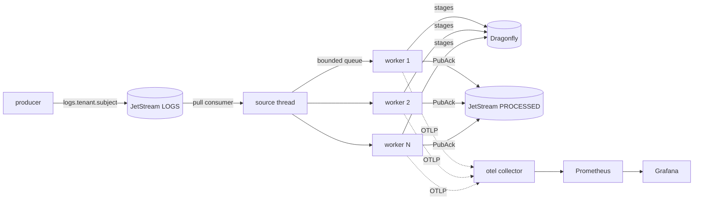
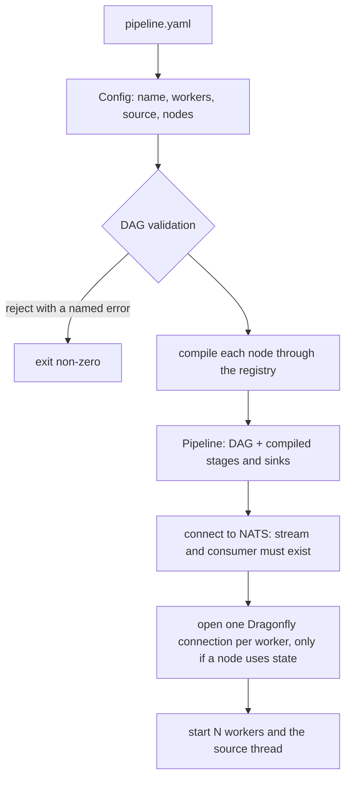
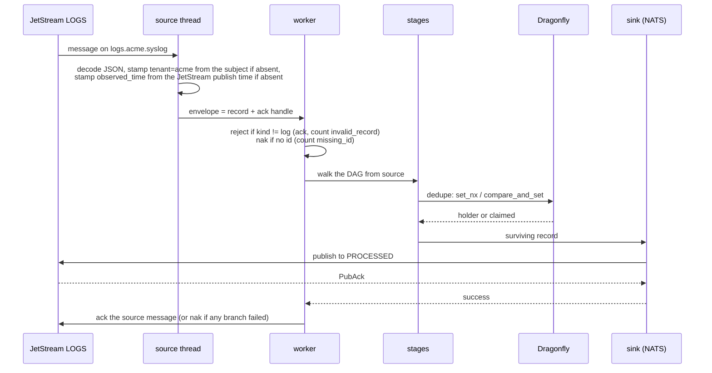
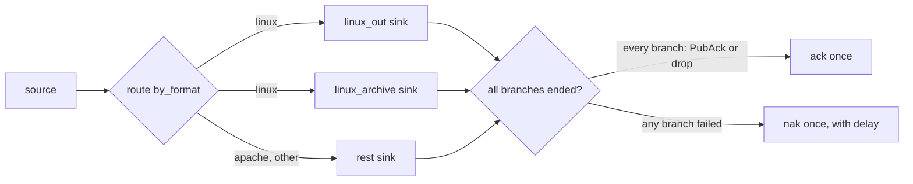
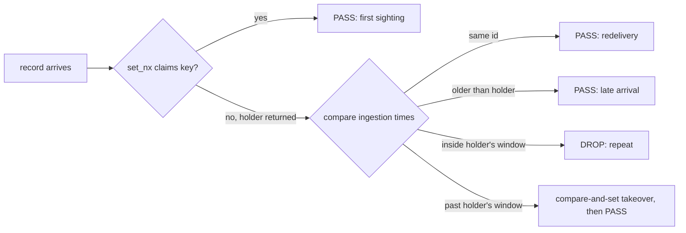

# The pipeline, end to end

This is the page to read when you want to know what the pipeline does today and how a record moves through it. It describes the code as it is, not the plan. The spec (`docs/specs/2026-09-08-observability-pipeline-poc.md`) is the source of truth when the two disagree; the glossary is `CONTEXT.md`.

## One paragraph

A producer publishes JSON log records to a NATS JetStream stream. The pipeline pulls them one message at a time, runs each record through a graph of stages you declared in YAML (filter, route, dedupe), and publishes the survivors to another JetStream stream. It acknowledges the incoming message only after every copy of the record has either been durably written by a sink or intentionally dropped. If anything fails, it negatively acknowledges and JetStream redelivers. Stages that need memory across records (dedupe) keep it in Dragonfly, shared by every worker and every replica, so scaling out does not change any answer. Everything the pipeline does is counted and exported as metrics.

## The moving parts



The binary is `pipelined --config <file>`. Its crates, in the order data meets them:

| Crate | Job |
|---|---|
| `nats` | The source (pull consumer, explicit ack) and the sink (returns only on `PubAck`). One tokio runtime for both. |
| `core` | The record model, field paths, the config loader and DAG validation, the engine, the `Source`/`Sink`/`Stage`/`StateStore`/`Recorder` traits, and in-memory fakes for all of them. |
| `stages` | `filter`, `route`, `dedupe`. |
| `state` | The Dragonfly store over the Redis protocol. |
| `otel` | The OTLP metrics exporter behind core's `Recorder`. |
| `regex` | A two-engine regex facade with ReDoS checks. Built and tested, not yet used by a stage (issue #5). |
| `pipeline` | Wires the above into the binary. |

## Startup: from a YAML file to a running graph



Validation is where most mistakes die, at load, with a message that names the node. The config is rejected when a node id is `source` (reserved), contains a dot or a colon, or is declared twice; when a `from` names a node that does not exist; when a node is unreachable from `source`; when the graph has a cycle; when there is no sink; when a consumer reads a label from a node that is not a route, or a label the route does not declare; and when a route declares a label, the default included, that nobody consumes. That last one matters: a record can never fall off the end of a router unnoticed.

Two things the pipeline refuses to do at startup. It never creates a stream or a consumer; the compose stack does that, and a missing one is a fail-fast error. And it never opens a state store connection for a config that has no stateful node, so a pipeline of filters runs without Dragonfly at all.

A minimal config:

```yaml
name: ingest            # first segment of every state key; replicas share it
workers: 4              # default: one per core
source:
  type: nats
  stream: LOGS
  consumer: pipeline
nodes:
  - id: keep_errors     # reads from `source` because it is first
    type: filter
    condition: severity_text == "ERROR"
    action: keep
  - id: out             # reads from keep_errors, the previous node
    type: sink.nats
    stream: PROCESSED
    subject: processed.logs
```

## One record, start to finish



Step by step:

1. The source thread pulls a message. The subject tells it the tenant (`logs.acme.syslog` is tenant `acme`). If the record carries no `resource.tenant.id`, the source writes it in. If the record carries no timestamp at all, the source writes the JetStream publish time into `observed_time_unix_nano`. That time is the server's and does not change when the message is redelivered, which matters later.
2. A payload that is not valid JSON, or not a record, is nakked and counted. It will run out `max_deliver` like any other poison message.
3. The envelope (record plus ack handle) goes onto a bounded queue, 64 deep per worker. Workers are plain OS threads that block on the queue.
4. A worker takes the envelope. Only `kind: log` is processed; a metric or span record is counted as `invalid_record` and acked, because there is nothing to retry. A record with no `id` is nakked and counted as `missing_id`.
5. The worker walks the graph synchronously, starting at the nodes that read from `source`. Each stage is one function: record in, one outcome out. The outcomes are `Pass(record)`, `Drop(reason)`, `Routed(label, record)`, `Split(records)`, `Error`, and `StateError { record, error }`.
6. A sink node publishes to JetStream and returns success only after `PubAck`. No `PubAck`, no success.
7. When every branch has ended, the worker settles the message: ack if every branch ended in sink success or a drop, nak otherwise. The nak carries a delay that starts at one second and doubles per delivery, so a sink that is down does not burn through the five allowed deliveries in milliseconds.

## Acks, branches and copies

The acknowledgement rule is the spine of the whole design. A record can fan out into several branches (two sinks reading the same label, or a route with consumers on more than one label). Each branch ends in one of three ways: a sink said yes, a stage dropped the record on purpose, or something failed. The source message is acked once when all branches have ended and none failed. If any failed, it is nakked once, after all of them have still run to the end.



Because a worker walks the graph as a recursion, the "outstanding branch counter" is the call stack itself. A panic inside a stage or sink is caught, counted as a stage error, and the record is nakked, so even a bug cannot lose a message.

Records are copy-on-write across branches. Fan-out hands every branch the same shared pointer. A sink reads through it. A stage takes ownership, which copies only while another branch still holds the record. So a mutation on one branch is never visible on another, and a graph with no fan-out never copies.

Drops are successes. A filter dropping a record, a route sending it to `drop`, dedupe suppressing a repeat: all of these end the branch cleanly and the message is acked. Every drop carries a reason from a closed set (`filter`, `route_default_drop`, `sample`, `dedupe`, `lua_drop`, `lua_error`, `regex_limit`, `state_error`, `invalid_record`, `missing_id`), and that reason is a metric label. Adding a reason is a spec change.

## The stages that exist

`filter` evaluates a condition and either keeps or drops the matches. `route` has an ordered list of labelled conditions; the first match wins, and the required `default` is a label or the reserved word `drop`. Consumers read `<route>.<label>`; two consumers on one label fan out, and a node with `from: [a, b]` fans in.

Conditions are `field op literal` joined with `and`, `or`, `not` and parentheses. Operators are `==`, `!=`, `<`, `>`, `<=`, `>=`, and `=~` / `!~` which parse today but are rejected at load until the regex ticket wires them. Fields are named by one dotted path everywhere: `body`, `severity_text`, `attributes.http.status`. Under `attributes`, `resource` and `scope`, the segments after the root joined with dots are the flat map key, and a segment with odd characters is double-quoted: `attributes."Event ID".code`. Every path error is a load-time error that says what to write instead.

`dedupe` is the stateful one and gets its own section.

## Dedupe and the state store

Stateful stages keep their memory in Dragonfly, one keyspace shared by every worker and every replica of a pipeline. What is per worker is the TCP connection: stages are synchronous, so one shared connection behind a lock would serialise every worker on each round trip. The engine opens the connections at start with a five-second connect timeout and a `PING`; each operation has a two-second timeout, and after any I/O error or timeout the connection is dropped and reopened on the next call, so a late reply is never read as the answer to a different command.

A stage never sees the connection. It gets a `State` handle on its context that prefixes every key with `{pipeline}:{tenant}:{node}:` and counts every operation. Tenant isolation is therefore structural: no stage can build a key that reaches another tenant, and no configuration can share one tenant's state with another's. A record with no tenant is scoped under `unknown`.

When Dragonfly cannot answer, the stage hands the record back with the error and the engine applies the node's `on_state_error`: `pass` forwards it as if the node were not there, `nak` fails it so JetStream redelivers. The stage only reports; the policy is the engine's.

How `dedupe` decides. One key per distinct content (a 64-bit FNV-1a hash of the chosen fields' values), holding the id and ingestion time of the record that owns the window, with the window as the key's TTL.



The window is measured in ingestion time (the record's own `observed_time_unix_nano`), never on the wall clock at the stage. This is the part worth understanding. A record passes, the process dies before the ack, the key expires, a newer duplicate claims it, and the original is redelivered thirty seconds later. Measured on arrival, it would look like a repeat and be dropped, a real record lost. Measured in ingestion time it is older than the holder, so it passes. Redelivery cannot change the answer because the source stamped the publish time, which is the same on every delivery.

The takeover, when a record is past the holder's window while the key still lives on the server clock, is a compare-and-set: write only if the key still holds the holder this worker read, otherwise the store answers with the current holder and the stage judges against that instead. Two workers taking over at once therefore agree on one new holder and the other drops as its repeat, and a slow worker cannot move a window backwards. One refusal is retried once; a second refusal passes the record without the key, so a busy key cannot hold a worker in a loop.

Two imperfections remain, both an extra copy and never a lost record: a record older than the holder arriving after it passes, and a duplicate delayed longer than the window passes. At-least-once prefers the copy.

## Metrics

Every operation is counted through one `Recorder` boundary, in memory in tests and OTLP in deploy. Export is over HTTP/protobuf to the collector when `OTEL_EXPORTER_OTLP_ENDPOINT` is set and off otherwise, so `cargo run` against a bare NATS works unchanged.

Every metric carries `tenant`. Per-node metrics carry `stage`, the node id, with the reserved `source` for decisions the engine takes before any node runs. `records_dropped_total{tenant, stage, reason}` is the spine; alongside it are `records_in_total`, `records_out_total`, `records_errored_total`, `stage_duration_seconds`, the three `state_*` metrics from the handle, `source_naks_total`, `source_redeliveries_total`, `sink_publish_duration_seconds`, `sink_publish_errors_total`, and `pipeline_end_to_end_seconds` measured on the ack from the ingestion time. The compose stack scrapes NATS and Dragonfly too, and the Grafana dashboard adds a row per stage on the first record it sees, with no dashboard edit.

## The regex facade

No stage uses it yet, but it is the part of the codebase with the most deliberate safety work, so it belongs here. A pattern compiles on the Rust `regex` crate first, which is linear time by construction and cannot backtrack. Only syntax that crate rejects (lookaround, backreferences, atomic groups, recursion) falls back to PCRE2, run under match, depth, heap, work and input-size limits, with JIT never invoked. Before a PCRE2-bound pattern is accepted at load, a lint walks its AST for catastrophic shapes and a canary runs it against generated adversarial inputs under the runtime limits. Every `unsafe` block in the workspace is in this crate's PCRE2 half.

## What is deliberately taken care of

- A message is acked only after durable acceptance downstream or an intentional drop. Anything else redelivers.
- Failure policy for the state store is per node and applied by the engine, so a stage cannot quietly swallow an outage.
- Windows are in ingestion time, so a crash between a state write and the ack never turns a real record into a duplicate.
- The takeover of an expired window is a compare-and-set, so scaling to more workers or replicas does not open a race.
- Tenant isolation in state is enforced by the handle, not by convention.
- The config is validated as a graph at load: unreachable nodes, cycles, unconsumed route labels and missing sinks are all rejected with the node named.
- The pipeline never creates infrastructure and fails fast when it is missing.
- Naks back off, so a dead sink does not exhaust redeliveries in a burst.
- A panic in a stage is contained, counted and nakked.
- Every behaviour above is tested through the trait boundary: a YAML config, records pushed through an in-memory source, assertions on which in-memory sink got what and how each ack handle settled. The live NATS and Dragonfly tests are ignored by default and run against the compose stack.

## Running it

```sh
docker compose -f deploy/compose.yaml up -d --build   # NATS, Dragonfly, collector, Prometheus, Grafana, pipeline
nats pub logs.acme.syslog '{"id": 1, "body": "disk full"}'
nats sub processed.logs --count 1
deploy/nats-smoke.sh                                  # end-to-end checks, exits non-zero on failure
deploy/metrics-check.sh                               # every metric has a producer and the right labels
open http://127.0.0.1:3000/d/fusion-internal
```

The compose pipeline (`deploy/pipeline.yaml`) drops `TRACE` records, dedupes on `body` over ten seconds with `on_state_error: nak`, and publishes the rest to `PROCESSED`. The consumer is created with `ack_wait` 30 s and `max_deliver` 5.

## Not built yet

Open on the tracker: the `pcre2_extract` and `redact` stages (#5), `sample` (#7), the sandboxed Lua stage (#8), the versioned pipeline swap (#9), the dead-letter queue after `max_deliver` (#10), the tenant dashboard with logs and traces (#12), the loghub producer and verifier (#13), the chaos test (#14), the `edit` stage (#21), a store-outage nak delay (#30), and an `op` label on the state metrics (#31). Metrics and spans are counted and rejected; only logs flow.
